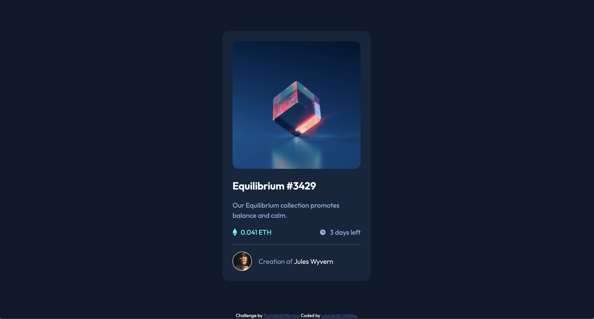

# Frontend Mentor - NFT preview card component solution

This is a solution to the [NFT preview card component challenge on Frontend Mentor](https://www.frontendmentor.io/challenges/nft-preview-card-component-SbdUL_w0U). Frontend Mentor challenges help you improve your coding skills by building realistic projects.

## Table of contents

- [Overview](#overview)
  - [The challenge](#the-challenge)
  - [Screenshot](#screenshot)
  - [Links](#links)
- [My process](#my-process)
  - [Built with](#built-with)
  - [What I learned](#what-i-learned)
- [Author](#author)

## Overview

### The challenge

Users should be able to:

- View the optimal layout depending on their device's screen size
- See hover states for interactive elements

### Screenshot



### Links

- Solution URL: [Add solution URL here](https://your-solution-url.com)
- Live Site URL: [Add live site URL here](https://your-live-site-url.com)

## My process

### Built with

- Semantic HTML5 markup
- CSS variables
- Flexbox
- Mobile-first workflow

**Note: These are just examples. Delete this note and replace the list above with your own choices**

### What I learned

Learned how to preven content cut off when resizing browser by setting a flex item's margin to auto instead of using justify content on a flex parent:

```css
.container {
	width: 100%;
	height: 100%;
	display: flex;
	flex-direction: column;
	/* justify-content: center; */
	align-items: center;
}

.card {
	background-color: var(--bg-card);
	padding: 1.5rem;
	border-radius: 15px;
	margin: auto;
	width: 85%;
	max-width: 350px;
}
```

### Continued development

Good experience thinking about reuseable styles. If i want a page with multiple cards, it would help if they all had a default style to them. Thinking about utility styles such as having different padding and margin styles to use on elements instead of applying those styles to every element.

I need more practice on how to create overlays.

## Author

- Website - [Leonardo Valdes](https://valdes91.github.io/)
- Frontend Mentor - [@valdes91](https://www.frontendmentor.io/profile/valdes91)
